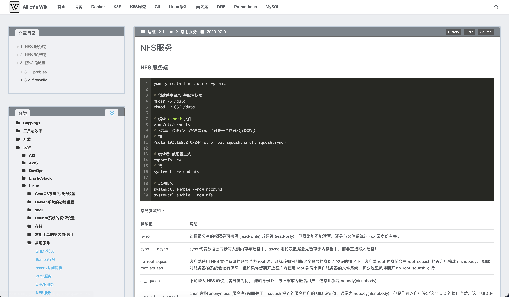
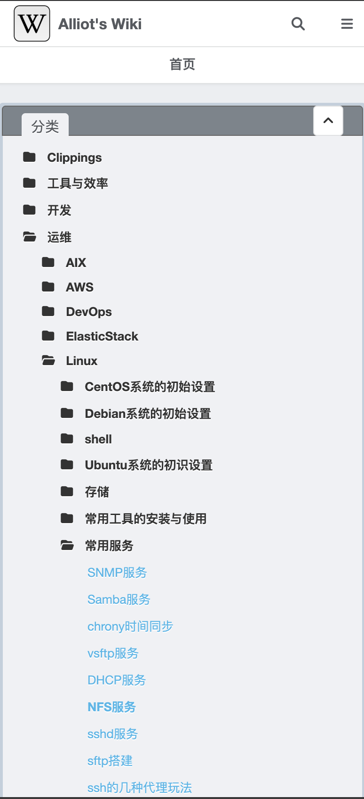
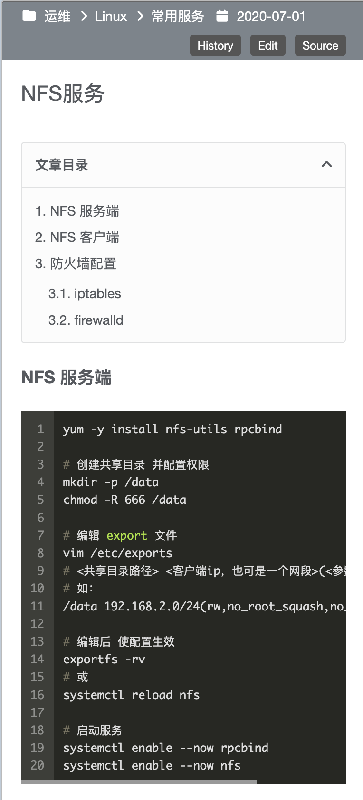

<div align="right">
  Language:
  English |
  <a title="Chinese" href="README_zh-CN.md">简体中文</a>
</div>

<picture>
  
</picture>

<p align="center">
  
  
</p>

# WikiFlow

> WikiFlow is a knowledge-focused [Hexo](https://hexo.io) theme for personal wikis, notes, and lightweight documentation sites.

[](https://www.npmjs.com/package/hexo-theme-wikiflow)
[](https://www.npmjs.com/package/hexo-theme-wikiflow)
[](https://hexo.io)
[](https://nodejs.org)
[](./LICENSE)

## Highlights

WikiFlow keeps the reading surface quiet and makes the content hierarchy easy to scan. It is especially suitable for personal knowledge bases where folders, categories, and article outlines matter more than a magazine-style index.

* Directory-based categories for wiki-like note organization.
* Two-column reading layout with an expandable category tree.
* Article table of contents in the sidebar and a compact mobile outline.
* Optional profile column, recent posts, archives, tags, tag cloud, and links widgets.
* Built-in Insight search UI, image lightbox, MathJax, Disqus comments, share links, and source/edit/history links.
* Alternate theme config and custom file injection for upgrade-friendly customization.

## Installation

If you are using Hexo 8.1.0 or later, the simplest installation path is through npm:

```sh
cd hexo-site
npm install hexo-theme-wikiflow
```

Copy the starter pages and scaffolds into your Hexo site:

```sh
cp -rf node_modules/hexo-theme-wikiflow/docs/starter/source/* source/
cp -rf node_modules/hexo-theme-wikiflow/docs/starter/scaffolds/* scaffolds/
```

Create an alternate theme config file:

```sh
cp -f node_modules/hexo-theme-wikiflow/_config.yml.example _config.wikiflow.yml
```

Then open the Hexo site config file and set `theme` to `wikiflow`.

```yml
theme: wikiflow
```

You can also clone the repository when you want to modify the theme source directly:

```sh
cd hexo-site
git clone https://github.com/AlliotTech/hexo-theme-wikiflow.git themes/WikiFlow
cp -rf themes/WikiFlow/docs/starter/source/* source/
cp -rf themes/WikiFlow/docs/starter/scaffolds/* scaffolds/
cp -f themes/WikiFlow/_config.yml.example _config.wikiflow.yml
```

When using `themes/WikiFlow`, set the theme name to the folder name:

```yml
theme: WikiFlow
```

## Site Configuration

WikiFlow is intentionally small at the theme layer. Directory categories, JSON search data, sitemap, feed, and nofollow behavior are site-level Hexo plugins, so install only the ones your site uses.

Recommended plugins for the default WikiFlow setup:

```sh
npm install --save hexo-directory-category hexo-generator-json-content
```

Optional site plugins:

```sh
npm install --save hexo-generator-feed hexo-generator-sitemap hexo-filter-nofollow
```

Recommended site `_config.yml` settings:

```yml
permalink: wiki/:title/

skip_render:
  - README.md
  - '_posts/**/embed_page/**'

new_post_name: :title.md

jsonContent:
  meta: false
  pages:
    title: true
    date: true
    path: true
    text: true
  posts:
    title: true
    date: true
    path: true
    text: true
    tags: true
    categories: true
  ignore:
    - 404.html

sitemap:
  path: sitemap.xml
```

`hexo-directory-category` lets article folders become category paths. `hexo-generator-json-content` is required when `search.insight` is enabled because WikiFlow reads `content.json` in the browser.

## Configuration

Do not edit files inside the installed theme package for normal site customization. Keep your changes in `_config.wikiflow.yml` so theme upgrades stay predictable.

The canonical commented example is [_config.yml.example](./_config.yml.example). Before publishing a site, replace the example values under `profile`, `social`, `post_history`, `open_graph`, and related personal options.

Common theme options:

```yml
sidebar:
  position: left

home:
  index_file: index.md

category:
  expand_all: false

recent_posts:
  thumbnail: true

footer:
  beian:
    enable: false
    icp:
    gongan_id:
    gongan_num:
    gongan_icon_url:

post_meta:
  updated_at:
    enable: true

codeblock:
  theme:
    light: github
    dark: github-dark

widgets:
  - category

search:
  insight: true

vendors:
  fontawesome: cdn
  open_sans: false
  source_code_pro: false
  mathjax: https://cdn.jsdelivr.net/npm/mathjax@4.1.2/tex-mml-chtml.js

plugins:
  gallery: true
  mathjax: true
  google_analytics:
  google_site_verification:

comment:
  disqus:
```

Markdown posts and pages show an outline by default. Set `toc: false` in front matter to hide it for a single page.

```md
---
title: My Note
date: 2026-06-15
toc: false
tags:
categories:
---
```

Thumbnails on archive and recent-post views come from `thumbnail` first and then `banner`. Post galleries use Hexo's `photos` front-matter field. The `embed` scaffold creates an iframe page from `iframe_url`, or from an `embed_page/index.html` file in the post asset folder.

## Plugins

Optional features are enabled from `_config.wikiflow.yml`.

* `search.insight`: enables the local Insight search overlay.
* `plugins.gallery`: wraps article images in a built-in lightbox.
* `plugins.mathjax`: loads MathJax for mathematical notation.
* `comment.disqus`: loads Disqus comments when a shortname is configured.
* `share: default`: enables the built-in share popover.
* `post_history.enable`: shows Source, Edit, and History links for content stored in a GitHub/GitLab-style repository.
* `footer.beian`: adds ICP and gongan beian links to the footer for Chinese websites.

### Configure CDN

Vendor assets are resolved through `_vendors.yml`. A vendor value can be `cdn`, `true`, `local`, `false`, or a custom URL.

```yml
vendors:
  fontawesome: cdn
  open_sans: false
  source_code_pro: false
  mathjax: https://cdn.jsdelivr.net/npm/mathjax@4.1.2/tex-mml-chtml.js
```

Use `local` only when the matching files are intentionally provided under `source/libs`; otherwise WikiFlow falls back to the CDN entries in [_vendors.yml](./_vendors.yml).

## Custom Files

WikiFlow provides upgrade-friendly injection points through `custom_file_path`. EJS fragments can be injected into view locations such as `head`, `header`, `sidebar`, `postMeta`, `postBodyStart`, `postBodyEnd`, `footer`, `bodyEnd`, and `comment`. Stylus files can be injected through `variable`, `mixin`, and `style`.

```yml
custom_file_path:
  head: source/_data/wikiflow-head.ejs
  style: source/_data/wikiflow-styles.styl
```

Place those files in your Hexo site, usually under `source/_data`, and keep theme source files untouched.

## Update

Update the npm installation:

```sh
cd hexo-site
npm install hexo-theme-wikiflow@latest
```

Update a source installation:

```sh
cd themes/WikiFlow
git pull origin main
```

After updating, compare your `_config.wikiflow.yml` with the latest [_config.yml.example](./_config.yml.example), then run:

```sh
hexo clean && hexo generate
```

## Development

WikiFlow is maintained by [AlliotTech](https://github.com/AlliotTech). The npm package uses a `files` allowlist so only runtime files, documentation assets, and starter files are published.

Run checks before changing shared theme behavior:

```sh
npm run lint
npm test
npm run test:package
```

Use `npm run test:browser` when changes affect browser runtime behavior.

## Feedback

* Report bugs in [GitHub Issues][issues-url].
* Request improvements in [GitHub Issues][issues-url].
* Send pull requests to [AlliotTech/hexo-theme-wikiflow][repo-url].

## Credits

WikiFlow is a maintained fork of `hexo-theme-Wikitten`. The original MIT license notices are preserved in this repository.

## License

[MIT License](./LICENSE)

[repo-url]: https://github.com/AlliotTech/hexo-theme-wikiflow
[issues-url]: https://github.com/AlliotTech/hexo-theme-wikiflow/issues
