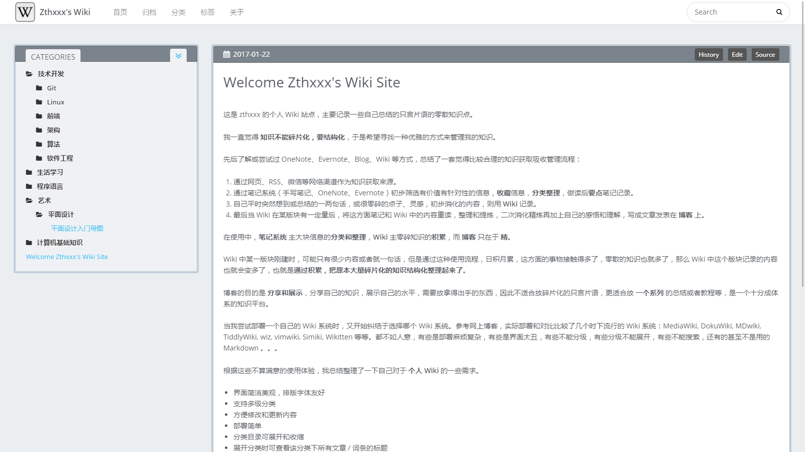
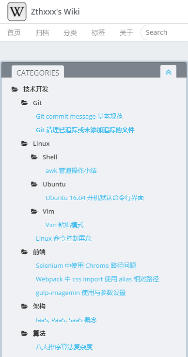
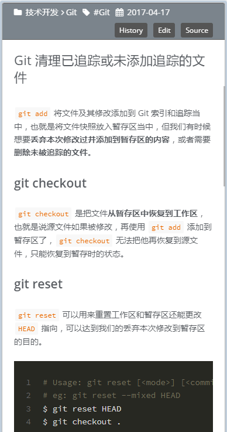

# hexo-theme-wikiflow

[English Page](./README.md)

### 一个面向知识管理和个人 wiki 的 Hexo 8 主题。

一些特性：

- 适用于个人 wiki 知识管理
- 简洁，双栏，分类
- 将知识多级分类整理，侧边分级展开，为思维跳转设计
- 根据文件路径自动为文章添加分类 #4




 


## 安装说明

`hexo-theme-wikiflow` 由 [AlliotTech](https://github.com/AlliotTech) 维护。项目是 `hexo-theme-Wikitten` 的持续维护 fork，并保留原始 MIT 许可证声明。

### 安装

**注意：本主题需要 Hexo 8.1.0 及以上版本，并需要 Node.js 20.19.0 及以上版本。**

1. 进入你的 Hexo 站点文件夹，安装主题包：

```bash
$ cd your-hexo-directory
$ npm install hexo-theme-wikiflow
```

2. 将主题提供的初始页面和脚手架复制到站点目录：

```bash
$ cp -rf node_modules/hexo-theme-wikiflow/_source/* source/
$ cp -rf node_modules/hexo-theme-wikiflow/_scaffolds/* scaffolds/
```

3. 将主题配置复制到站点根目录：

```bash
$ cp -f node_modules/hexo-theme-wikiflow/_config.yml.example _config.wikiflow.yml
# 编辑配置文件，定制你的配置项
$ vim _config.wikiflow.yml
```

推荐的站点配置和主题配置见下方 [配置说明](#配置说明)。

4. 可选站点插件如下。请只在 Hexo **站点**项目中安装你需要的功能。

这里列出了这些插件的功能作用：

```json
hexo-directory-category // 根据文章文件目录自动为文章添加分类
hexo-generator-feed	    // 生成 RSS 源
hexo-generator-json-content	// 生成全站文章 json 内容，用于全文搜索
hexo-generator-sitemap	// 生成全站站点地图 sitemap
hexo-filter-nofollow    // 为外部链接添加 rel="nofollow"
```

你可以将这些插件合并到**站点**的 `package.json` 文件中通过 `npm install` 一次安装，

或者在**站点目录**下，你可以通过以下命令安装他们：

```bash
$ npm i -S hexo-directory-category hexo-generator-feed hexo-generator-json-content hexo-generator-sitemap hexo-filter-nofollow
```

5. 配置mathjax渲染（可选）：

如果你在博客中需要撰写数学公式，推荐进行以下配置：

首先安装[pandoc](https://pandoc.org/installing.html)，同时在hexo站点下修改渲染引擎：

```bash
$ npm un hexo-renderer-marked --save
$ npm i hexo-renderer-pandoc --save # or hexo-renderer-krammed
```

然后将以下配置加到站点`_config.yml`文件中：

```bash
math:
  enable: true
  engine: mathjax
```


### 源码安装

如果你想直接基于仓库源码修改主题，可以克隆到 `themes/WikiFlow`：

```bash
$ cd your-hexo-directory
$ git clone https://github.com/AlliotTech/hexo-theme-wikiflow.git themes/WikiFlow
$ cp -rf themes/WikiFlow/_source/* source/
$ cp -rf themes/WikiFlow/_scaffolds/* scaffolds/
$ cp -f themes/WikiFlow/_config.yml.example themes/WikiFlow/_config.yml
```

### 启用

修改站点 `_config.yml` 文件中的 `theme` 选项：

```yaml
theme: wikiflow
```

如果使用源码安装路径 `themes/WikiFlow`，这里应设置为 `WikiFlow`。

### 更新

使用 npm 安装时：

```bash
$ npm install hexo-theme-wikiflow@latest
```

使用源码安装时：

```bash
$ cd themes/WikiFlow
$ git pull origin main
```


## 配置说明

在站点配置文件 `_config.yml` 中， **推荐配置为**：

```yaml
# Hexo Configuration
# URL
permalink: wiki/:title/

# Directory
skip_render:
  - README.md
  - '_posts/**/embed_page/**'

# Writing
new_post_name: :title.md # File name of new posts

## Markdown
## https://github.com/hexojs/hexo-renderer-marked
marked:
  gfm: true
  
## Plugins: https://hexo.io/plugins/
### JsonContent
jsonContent:
  meta: false
  pages:
    title: true
    date: true
    path: true
    text: true
  posts:
    title: true
    date: true
    path: true
    text: true
    tags: true
    categories: true
  ignore:
    - 404.html
    
### Creat sitemap
sitemap:
  path: sitemap.xml

### 为外部链接添加 nofollow 属性。使用前请先安装 `hexo-filter-nofollow`。
nofollow:
  enable: true
  exclude:
    - <your site url domain> # eg: example.com
```

在**主题**配置文件 `WikiFlow/_config.yml` 中，你能阅读到各个选项更多的细节配置。

**发布站点前，请将 `profile`、`social_links`、`history_control` 等主题选项中的示例个人信息改成你自己的信息。**

### `profile`、`comment`、`Share` 和 `miscellaneous` 项都是 **默认关闭的**！ 

内置评论集成使用 Disqus。

内置图库使用轻量的原生 JavaScript 图片查看层。

## 可选功能

WikiFlow 将 wiki 导航、文章布局和搜索界面作为主题核心体验。浏览器侧增强功能通过主题配置控制，站点项目可以避免在生成页面中输出未使用的功能：

```yaml
vendors:
    fontawesome: local
    open_sans: local
    source_code_pro: local
    mathjax: https://cdnjs.cloudflare.com/ajax/libs/mathjax/2.7.1/MathJax.js?config=TeX-AMS-MML_HTMLorMML

plugins:
    gallery: true
    mathjax: true
    google_analytics:
    google_site_verification:

comment:
    disqus:
```

设置 `plugins.gallery: false` 可关闭内置图片查看层。设置 `plugins.mathjax: false` 可关闭数学公式渲染，也可以通过 `vendors.mathjax` 指定脚本地址。样式类 vendor 可以使用 `local` 加载主题内置资源，使用 `false` 不输出 link 标签，或填写外部样式表 URL。

## 工程化

npm 包通过 `files` 白名单控制发布内容。发布前可以运行 `npm pack --dry-run` 检查 tarball 中包含的文件。

修改共享主题行为前建议运行：

```bash
$ npm run lint
$ npm test
$ npm run test:browser
```

可选的浏览器侧资源统一记录在 `_vendors.yml` 中。除非明确决定内置并写清楚授权，否则不要把第三方构建产物提交到 `source/libs`。

其他的 **推荐设置为**：

```yaml
# Customize
customize: # 首先修改这项里面的信息为你自己的各项信息
    sidebar: left # 侧边栏的所在位置，默认左边
    category_perExpand: false # 侧边栏里的各个分类是否默认全部展开
    default_index_file: index.md # 是否指定一篇文章作为首页来代替默认的多篇文章的首页，没有此项的话就会显示默认的按时间顺序排列的文章
    
# Widgets
widgets: # 挂件，默认指开启了分类这一栏
    - category
    # - recent_posts
    # - archive
    # - tag
    # - tagcloud
    # - links
    
# History version 
history_control: # 启用这一项使得 wiki 能有历史版本的功能（查看源码、在线编辑、对比历史变动）
    enable: true
    server_link: https://github.com # 版本控制服务器，推荐使用 GitHub https://github.com
    user: <your GitHub name>
    repertory: <your repertory name of this wiki source code>
    branch: <branch name of this wiki site source code>
```


## 版权协议

[MIT LICENSE](./LICENSE)

本项目在随附许可证声明中保留上游 MIT 授权作品的必要归属。重新分发修改版本时，请保留版权和许可证声明。
